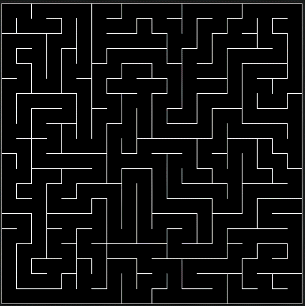
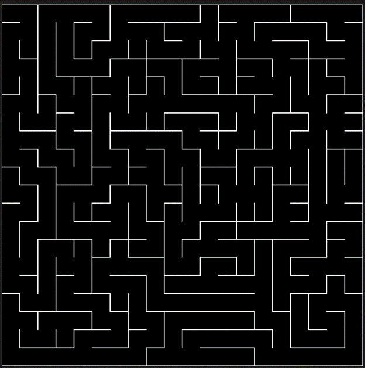
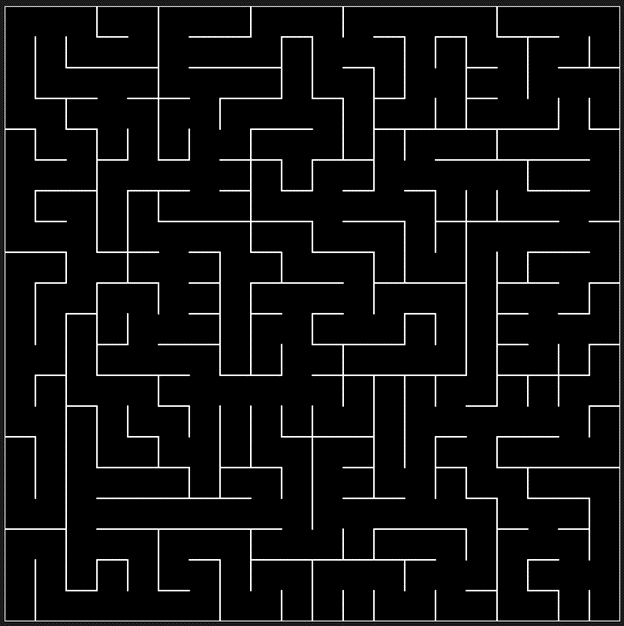

# Maze Generator

## Table of Contents

- [Maze Generator](#maze-generator)
  - [Table of Contents](#table-of-contents)
  - [Description](#description)
    - [Display](#display)
      - [Examples](#examples)
    - [Folder structure](#folder-structure)
    - [Programming language(s)](#programming-languages)
  - [Installation](#installation)
  - [Usage](#usage)
    - [Invocation](#invocation)
    - [Operation](#operation)
  - [Contributions](#contributions)

## Description

This program generates a random maze by starting with a random walk until a set fraction of cells have been visited, at which point the program continues the maze generation via depth-first backtracking. Higher configured difficulties cause harder mazes and longer generation times.  
Start date: 2020-10-28  
Current version: 0.1.0  

### Display

#### Examples

0%-difficulty:

50%-difficulty:

75%-difficulty:

### Folder structure

| Tree with Root Having Local Path | Generation Method | Description |
| -------------------------------- | ----------------- | ----------- |
| <https://github.com/anderjef/Maze_Generator> | auto-generated by Processing | <!-- --> |

### Programming language(s)

- JavaScript
  - [Maze_Generator.js](./Maze_Generator.js)&mdash;main program entrance containing all pertinent code
  - [Cell.js](./Cell.js)&mdash;defines Cell class
  - [LineSegment.js](./LineSegment.js)&mdash;defines LineSegment class
  - [MazeGraphic.js](./MazeGraphic.js)&mdash;defines MazeGraphic class
  - [Point.js](./Point.js)&mdash;defines Point class

## Installation

1. p5.js Web Editor
    - Go to <https://editor.p5js.org/> and open a new sketch.
    - Either create the directory structure as seen under the root folder <https://github.com/anderjef/Maze_Generator> then copy the content of each file to the respectively named file in the new sketch, or delete the starter index.html and sketch.js then download [ZIP](https://github.com/anderjef/Maze_Generator/archive/main.zip) then upload the (JavaScript, CSS, and HTML) files from the root folder.

## Usage

### Invocation

1. Method 1&mdash;p5.js in web browser
    - Open <https://anderjef.github.io/Maze_Generator/>.
2. Method 2&mdash;p5.js Web Editor
    - See [Installation](#installation).

### Operation

Configure the variables at the top of [Maze_Generator.js](./Maze_Generator.js) as desired. Sit back, relax, and enjoy!

## Contributions

- Jeffrey Andersen&mdash;developer
- [YouTube The Coding Train Video 1](https://www.youtube.com/watch?v=HyK_Q5rrcr4), [YouTube The Coding Train Video 2](https://www.youtube.com/watch?v=D8UgRyRnvXU), [YouTube The Coding Train Video 3](https://www.youtube.com/watch?v=8Ju_uxJ9v44), and [YouTube The Coding Train Video 4](https://www.youtube.com/watch?v=_p5IH0L63wo)&mdash;inspiration

For copyright, license, and warranty, see [LICENSE.md](LICENSE.md).
